```
#include <stdio.h>

int main()
{
	printf("hello, world\n);
	return 0;
}
```
**hello.c**

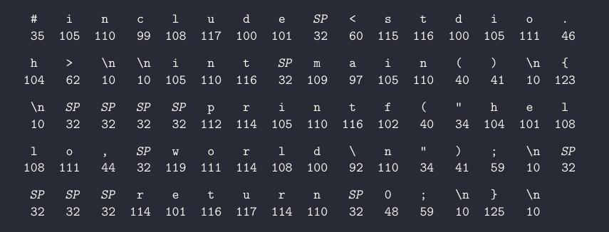

**The ASCII text representation of the above program**

The hello.c program is actually a sequence of bits stored in a text file. They are organized in 8-bit chunks to form a byte. Each byte corresponds to a ASCII character as represented above for hello.c program.
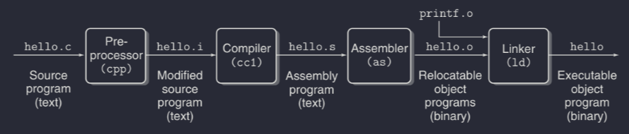

Fig 1.3 **The compilation system**

The above system is responsible to convert the C program which is in high-level language to an executable object which are low-level machine-language instructions bundled together.

`linux > gcc -0 hello hello.c`
`gcc`  is the compiler here which performs the translation from source code to executable object in four phases. 

- Phase 1 : **Preprocessing Phase** 
The preprocessor(`cpp`) modifies the original C program directives (`#`) to read its contents and include it directly in the program text, which results in another C program with .i suffix.

- Phase 2 : **Compilation Phase**
The compiler(`cc1`) coverts the hello.i file to hello.s file which contains the assembly-level program.

- Phase 3 : **Assembly Phase**
The assembler(as) translates hello.s into machine language instructions, then packages them in a form know as a **relocatable object program** and stores the result in the object file hello.o.

- Phase 4: **Linking Phase**
The linker(`1d`) handles the merging of dependent functions of the source program like `printf` in hello.c which results in executable object file hello ready to be executed.


*Difference between relocatable object program and executable object program*
- A **relocatable object program** is an intermediate file produced by the assembler. It contains machine code generated from assembly language code, but it’s not yet ready for execution.
- **Relocation Information**: Contains data that allows the linker to adjust addresses based on where the object file is placed in memory. This means the addresses in the object file are placeholders that will be updated by the linker.

- An **executable object program** is the final output of the linking process. It’s a complete binary file that can be directly executed by the operating system.
- **Fully Resolved Addresses**: All addresses and symbols are resolved. The linker has adjusted the code and data locations to match the final memory layout.

##### Understanding how compilation system works
- Optimizing program performance. We need a basic understanding of machine level code and how the compiler translates different C statements into machine level code.
- Understanding link time errors. Complicated errors which are related to the operation of linker. Example: `> Cannot resolve a reference.`
- Avoiding Security Holes. We can avoid major vulnerabilities by understanding how data and control information are stored on the program.

##### Processor Read and Interpret Instructions Stored in Memory
A shell is a command-line interpreter
```
linux> ./hello
hello, world
linux>
```
Execution of the hello file produced by compilation.

##### Hardware Organization of a System
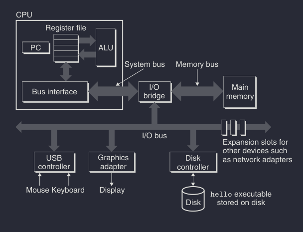

**Buses**
Electrical conduits that run throughout the system carrying fixed size chunks of bytes known as words(data) between components. Most machines have words sizes 4 bytes(32 bits) or 8 bytes(64 bits).

**I/O Devices**
Input Output devices. Each I/O device is connected to the I/O bus by either a controller or an adapter.

**Main Memory**
Physically main memory consists of a collection of Dynamic Random Access Memory(DRAM) chips.

**Processor**
It interprets the instructions stored in main memory. It has a program counter(PC), which at any point in time points to a machine instruction in main memory. A processor appears to operate according to a very simple instruction execution model, defined by its *instruction set architecture*.

- Load: Copy a byte or a word from main memory into a register, overwriting the previous contents of the register.
- Store: Copy a byte or a word from a register to a location in main memory, overwriting the previous contents of that location.
- Operate: Copy the contents of two registers to the ALU, perform an arithmetic operation on the two words, and store the result in a register, overwriting the previous contents of that register.
- Jump: Extract a word from the instruction itself and copy that word into the program counter (PC), overwriting the previous value of the PC.
##### Running the `hello` program
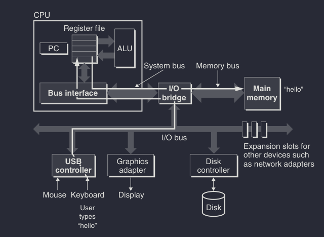

The input flows from the I/O device to the register which is then stored in memory. Once the command is entered the shell loads the executable file(hello) form disk directly to the main memory using a technique known as *Direct Memory Access*. After the code and data has been loaded into memory, the processor begins executing the machine-language instructions in the hello program's main routine. Here the data hello world\n gets to the display device to be displayed on screen.

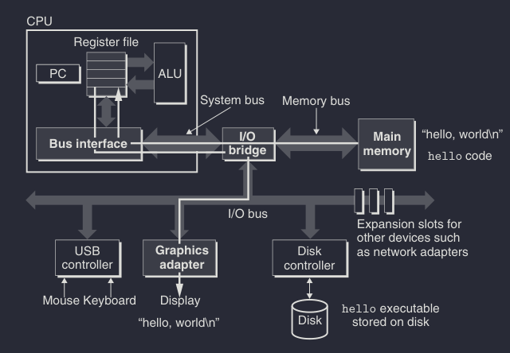

**Writing the output string from memory to the display**

#### Caches Matter
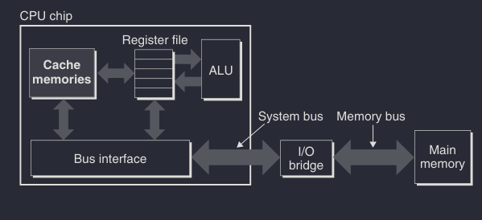

So as there is a lot of copying there is overhead and the system designers work on making these operations run faster. Due to physical laws large storage devices are slower than smaller storage devices. The processor runs at higher speeds than the main memory, and this gap is increasing. To bridge this gap the smaller, faster storage devices called cache memories which serve as temporary storage devices, they store frequently accessed data for quick retrieval.

**Cache levels**:
- **L1 cache**: Smallest and fastest, located on the processor chip.
- **L2 cache**: Larger than L1, slightly slower, but still much faster than main memory.
- Some systems have **L3 cache** as well.
Caches use Static Random Access Memory, which is faster but more expensive than main memory. Programs tend to access data in localized regions and caches exploit this tendency to improve the overall system performance.

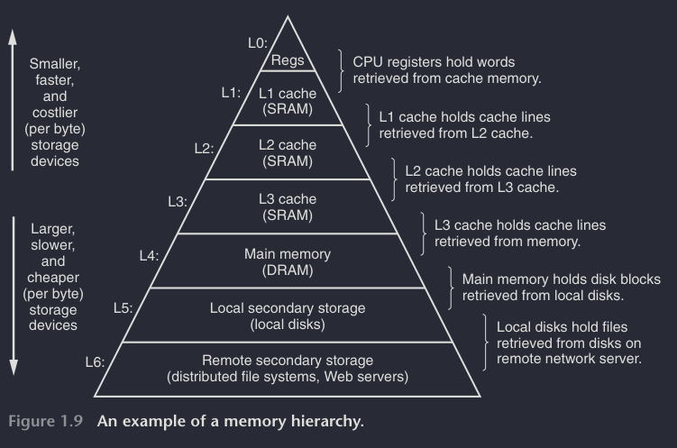

#### Storage Devices Form a Hierarcy
The main idea of a hierarchy is that storage at one level serves as a cache for the next lower level. For example register serves as cache for L1, L1 as cache for L2 and so on. Programmers can exploit knowledge of the different caches to improve performance.

#### The Operating System Manages the Hardware
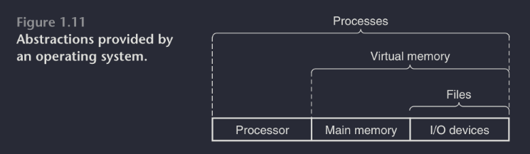

Operating system is an intermediate between the application program and hardware, so any attempts to manipulate the hardware must go through OS.
OS has two main purposes: 
1) to protect the hardware from misuse 
2) provide mechanism to manipulate low-level hardware using an application program
It achieves both goals via abstractions shown in above image. These abstractions provide programmers an easy way to deal with hardware.

##### **Processes**
A process is the operating system's abstraction for a running program. Multiple processes can run concurrently on the same system. A CPU with a single or multiple processors execute multiple processes concurrently by having the processor switch among them. This mechanism is called *context switching*.

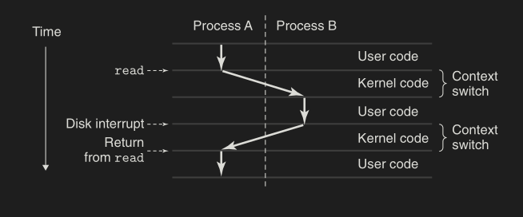 

While making the switch between processes the OS saves the context of the current process and then restoring the context of the next process and the incoming process picks up where it left off. The context-switching is managed by the system kernel.

##### **Threads**
A process can consist of multiple execution units called threads, each running in the context of the process and sharing the same code and global data. Multi-threading model make programs run faster with multiple processors. Used in network servers to enable concurrency because it easier to share data between threads than processes.

##### **Virtual Memory**
It is an abstraction that provides each process with the illusion that it has exclusive use of the main memory. Each process has same uniform view of the memory knows as virtual address space.

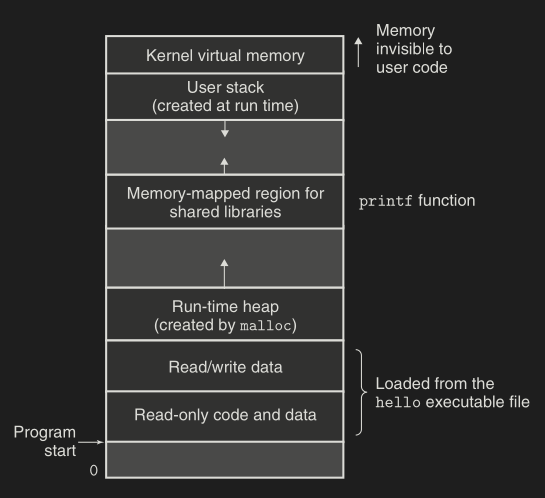

##### **Files**
A file is a sequence of bytes. Every I/O device is modeled as a file. All input and output in the system is performed by reading and writing files using system calls known as Unix I/O.
This notion of a file provides with a generic view of the I/O devices contained in the system.

#### System Communicate with Other Systems Using Networks
The network can be viewed as another I/O device. Due to the significance of internet use case of copying data has increased and hence many applications are based on it like email, FTP etc.

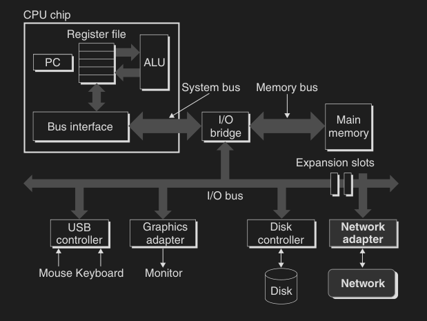

#### Important Themes

##### **Amdahl's Law**
States the effectiveness of improving the performance of one part of the system.

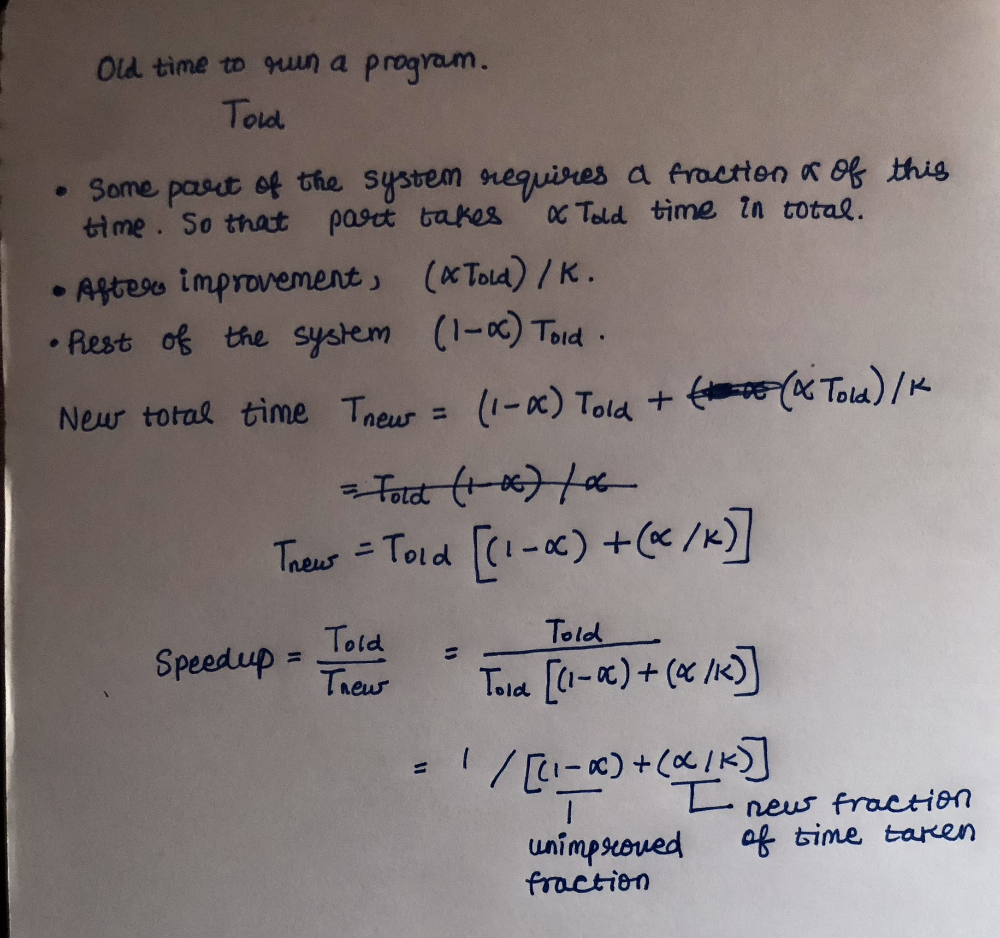

##### **Concurrency and Parallelism**
We use concurrency to refer to the general concept of a system with multiple, simultaneous activities, and parallelism to refer to the use of concurrency to make a system run faster. Parallelism can be exploited at multiple levels of abstraction in a computer system. Below are three levels.
***Note:*** Concurrency is about dealing with multiple tasks that can progress over overlapping time periods, but it doesn't necessarily mean they execute simultaneously. Concurrent execution can be achieved through interleaving on a single processor. Parallelism, which involves true simultaneous execution, is a form of concurrency, but not all concurrent systems are parallel.

1. **Thread-Level parallelism**
	Multi-core processors have multiple CPUs integrated onto a single chip.

	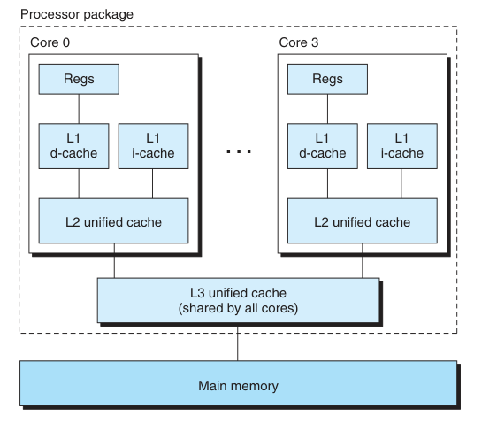

	Each has its own L1 and L2 cache. L1 is split into two, one to hold the fetched instruction and the other to hold data. The cores share higher levels of cache and an interface to main memory.
	**Hyperthreading**, also called simultaneous multi-threading, which allows a CPU to execute multiple flows of control by having copies of PC and register. A hyperthreaded processor decides which of its threads to execute on a cycle-by-cycle basis.The ability to switch on every clock cycle comes from having multiple threads "ready to go" at all times within the processor itself. As an example, the Intel Core i7 processor can have each core executing two threads, and so a four-core system can actually execute eight threads in parallel.

2. **Instruction-Level parallelism**
	At a lower level of abstraction modern processors can execute multiple instructions at one time. Processors that can sustain more than one instruction per cycle are called *superscalar* processors.

3. **Single-Instruction, Multiple-Data (SIMD) Parallelism**
	At the lowest level, many modern processors have special hardware that allows
	a single instruction to cause multiple operations to be performed in parallel, a
	mode known as single-instruction, multiple-data (SIMD) parallelism. 
	For example,recent generations of Intel and AMD processors have instructions that can add 8 pairs of single-precision floating-point numbers (C data type float) in parallel.
